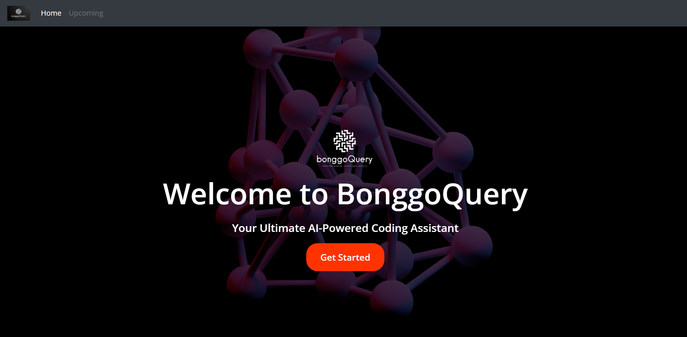
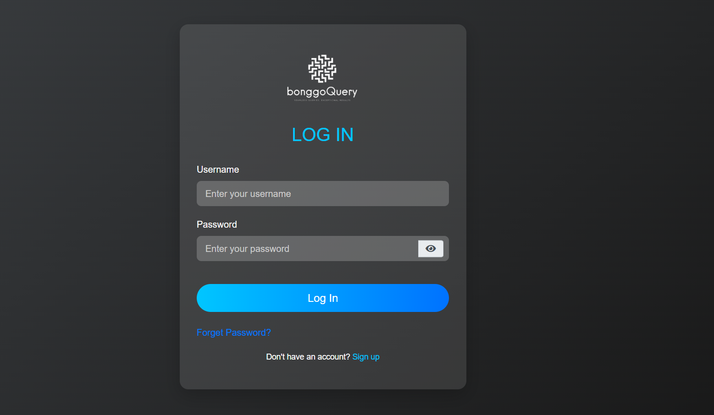
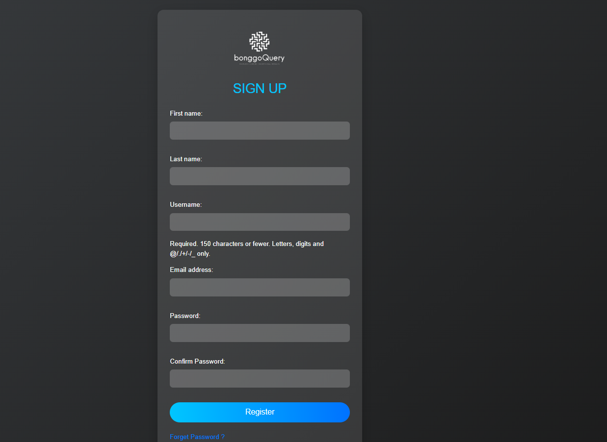
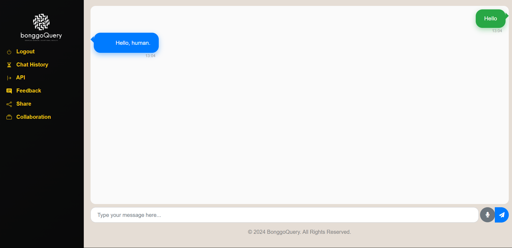
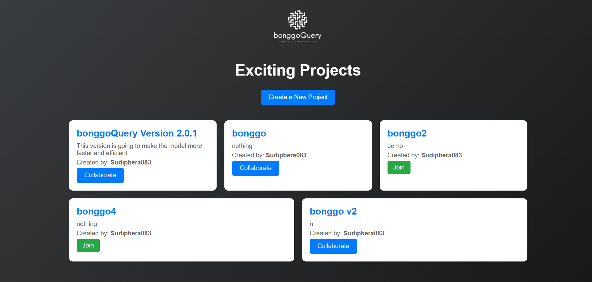

# BonggoQuery Web


BonggoQuery Web is an interactive and dynamic web application built with Django, designed to simplify coding experiences and offer virtual assistant features such as weather reports, date and time, location, and search functionalities.

## 🖥️ Live Demo
Coming soon!

## 📂 Repository
Explore the complete code on GitHub: [BonggoQuery Web](https://github.com/SudipBera083/bonggoQueryWeb)

## 🚀 Features
- User Authentication (Sign Up, Log In)
- Real-time Chat Interface
- Virtual Assistant Capabilities
- Weather, Time, Date, and Search functionalities
- Collaboration with other users
- Dynamic and attractive UI

## 🛠️ Technologies Used
- **Backend:** Django, Django REST Framework
- **Frontend:** HTML, CSS, JavaScript
- **Styling:** Tailwind CSS
- **Database:** SQLite
- **Animations:** Framer Motion
- **Icons:** Lucide Icons

## 📸 Sample Screenshots
### Home Page


### Log In Page


### Sign Up Page


### Chat Panel


### Collaboration


## 📜 Setup Instructions
1. Clone the repository:
```bash
git clone https://github.com/SudipBera083/bonggoQueryWeb.git
```
2. Navigate to the project directory:
```bash
cd bonggoQueryWeb
```
3. Install dependencies:
```bash
pip install -r requirements.txt
```
4. Run migrations:
```bash
python manage.py migrate
```
5. Start the server:
```bash
python manage.py runserver
```
6. Open [localhost:8000](http://localhost:8000) in your browser.

## 💬 Contact
Feel free to reach out via [LinkedIn](https://www.linkedin.com/in/sudipbera083/) or [Email](mailto:sudipbera083@gmail.com).

---
Made with ❤️ by Sudip Bera
